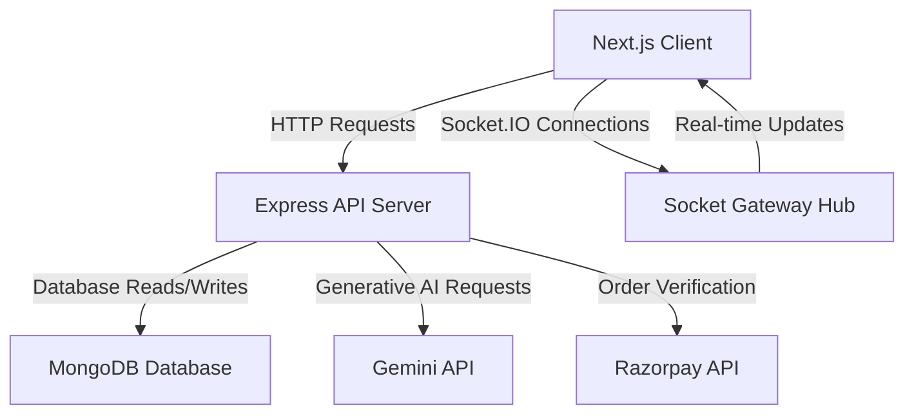
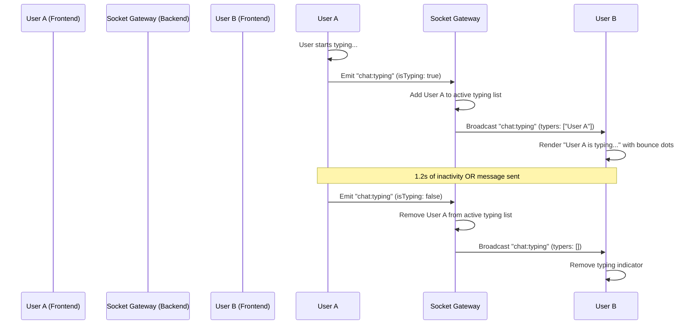

# System Functionality & Architecture Guide

This document explains the technical architecture, operational flow, and implementation details of the key features inside **  AI Chat**.

---

## 🗺️ System Overview

The application is structured as a monorepo containing:
1. **Next.js Single Page App (SPA) Frontend**: Handles user interface, client-side socket subscriptions, interactive modals, and payment triggers.
2. **TypeScript Express Backend Server**: Hosts Rest APIs, validates tokens, coordinates the Gemini AI engine, and runs Socket.IO gateway hubs.
3. **Shared Database (MongoDB)**: Persists user profiles, subscription states, and chat message history.

---

## 🗝️ Feature Walkthroughs

### 1. Google OAuth Authentication Flow
Authentication secures access to rooms, messages, and premium endpoints:
* **Frontend Sign-In**: The client renders Google's login buttons. Upon completion, the credential token is captured and sent to the backend `/api/auth/google` endpoint.
* **Backend Verification**: The server verifies the Google ID token, queries/creates the User profile in MongoDB, and issues a JSON Web Token (JWT).
* **HTTP-Only Cookies**: The JWT is returned via a secure ` _access_token` cookie, which prevents XSS leakage and automatically attaches to future HTTP and WebSocket handshakes.

---

### 2. Socket.IO Real-time Connection & Room Sync
All live actions (chatting, online presence, and typing status) flow through WebSockets:
* **Authentication Handshake**: The WebSocket server uses custom cookie-parsing middleware to extract the JWT, validating the client before establishing a socket connection.
* **Room Subscription**: The client automatically joins the `"product-design-sync"` room.
* **Reconnection Resiliency**: Sockets are volatile and reconnect on minor network shifts. The frontend listens to socket `connect` events to automatically re-emit `"chat:join"` to rejoin backend rooms instantly.

---

### 3. Interactive Chat Feed & Auto-Scroll
The messages list is optimized for dynamic feeds:
* **Instant Scroll on Load**: When the page loads or messages are first fetched (transitioning from `0` to `N` messages), the container snaps to the bottom without animation, hiding the transition from the user.
* **Smooth Scroll on New Message**: When `messages.length` increases (user sends/receives a message), the container executes a smooth scrollTo animation, landing precisely on the newest message.

---

### 4. Typing Indicator Event Flow
Typing indicator states are synchronized efficiently across clients:
* **Throttled Keypress Triggers**: When a user inputs text in the message field, `handleDraftChange` emits a `"chat:typing"` state with `isTyping: true`.
* **Debounced Stop Typing**: A timeout of `1.2s` is scheduled. If no keystrokes are recorded in that window, or if the user sends the message, the client cancels the timeout and sends `isTyping: false`.
* **Backend State Tracking**: The server maps socket IDs to active typers per room and broadcasts the list of names to all subscribers.
* **Animated Rendering**: The client filters out the current user and displays a message like *"Alice is typing..."* alongside a staggered, bounce-animated 3-dot typing loader.

---

### 5. Gemini AI Assistance
Premium AI integrations are handled securely:
* **AI Suggestions**: Clicking "AI Suggest" sends the room's message history to the backend. The backend prompts Google Gemini to generate context-appropriate quick replies, updating the suggestions panel.
* **Chat Summary**: Clicking "Generate new summary" reads the active history and creates a concise, high-level summary of the chat using generative intelligence.
* **Access Control**: These features are guarded. Non-premium users are intercepted and shown a conversion upsell modal.

---

### 6. Razorpay Premium Payment Integration
Upgrading to premium features is simulated using test keys:
* **Order Creation**: Clicking "Upgrade" requests `/payments/create-order` from the backend to generate a Razorpay transaction order.
* **Razorpay Checkout SDK**: The frontend triggers the Razorpay modal. The developer/user inputs the mock credentials:
  - **Card Number**: `4111 1111 1111 1111`
  - **Expiry**: Future Month/Year
  - **CVV**: `123`
* **Signature Verification**: Razorpay replies with signatures. The frontend forwards these to `/payments/verify` on the backend, which performs HMAC SHA256 checksum validations.
* **Global Activation**: Once verified, the backend flags the user as `isPremium: true` in the DB and broadcasts a `"payment:premium-activated"` socket event to the user's private socket room, instantly updating the UI across all active tabs and showing a premium success modal.

---

### 7. Redis Caching Layer
To optimize performance and database lookups, a Redis caching layer has been integrated:
* **High-Performance Caching**: Employs key-value caching using the official Redis client. If the local system doesn't have Redis running, it automatically falls back to a mock in-memory store, preventing server crashes.
* **AI Content Cache-Aside**: Hashes the conversation context using MD5 to form unique cache keys. If the generated AI summary and suggested replies for that exact context are found in Redis, they are returned instantly. Otherwise, the Gemini service is called and the results are cached with a 5-minute Time-To-Live (TTL).
* **Presence Caching**: Active users online in the room are serialized and cached under `presence:<roomId>` with a 1-hour TTL, laying the foundation for scaling websocket states horizontally.

---

### 8. Cursor-Based Pagination & Infinite Scroll
Traditional offset pagination suffers from scaling issues and scroll-jumping bugs. We implemented cursor-based pagination for older messages:
* **Query Optimization**: Messages are fetched ordered descending (`createdAt: -1`). A limit of `20` plus one extra message is fetched to determine `hasMore`. The array is reversed chronologically before responding to client, returning `{ messages, nextCursor }`.
* **Scroll-up Trigger (Infinite Scroll)**: The client listens to the `onScroll` event of the chat list container. When `scrollTop` is close to the top, it queries the backend for older messages using the oldest message's timestamp (`nextCursor`).
* **Non-Jarring Viewport Restoration**: Before prepending the fetched messages, the client captures the current `scrollHeight` of the container. After setting the messages, the scroll top is restored to `container.scrollHeight - prevScrollHeight`. This prevents the viewport from jumping, maintaining a smooth, seamless reading layout.
